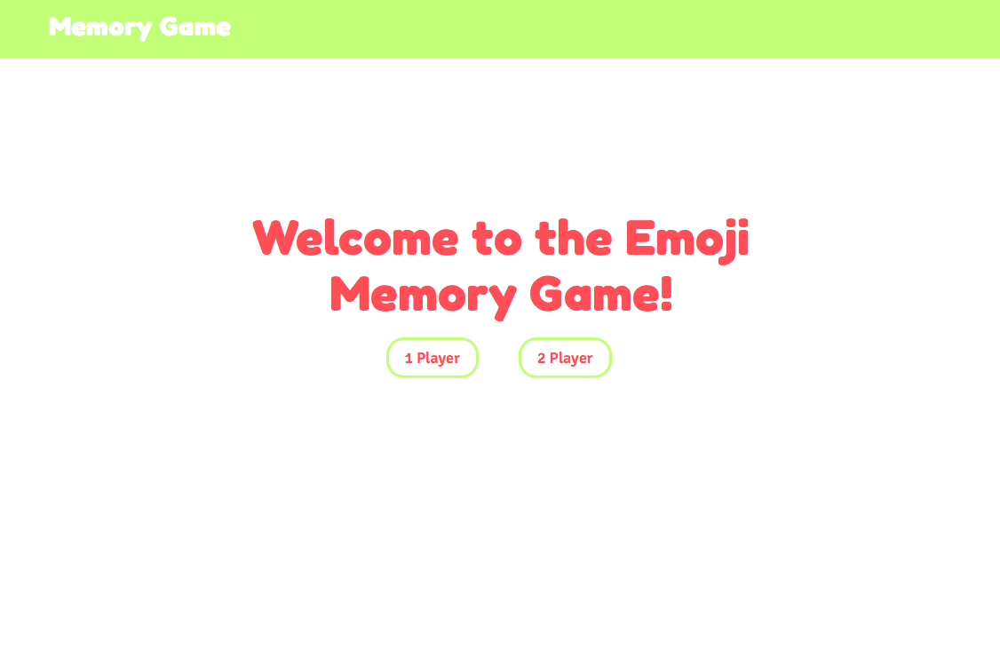
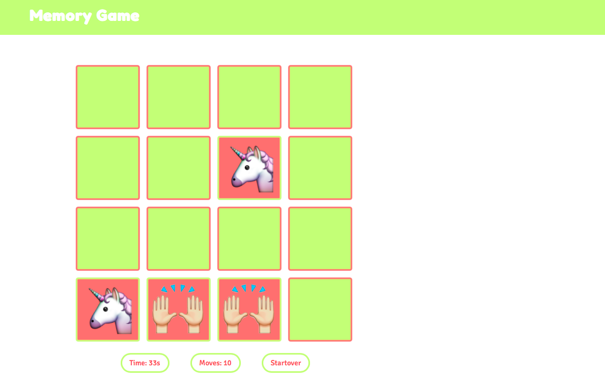
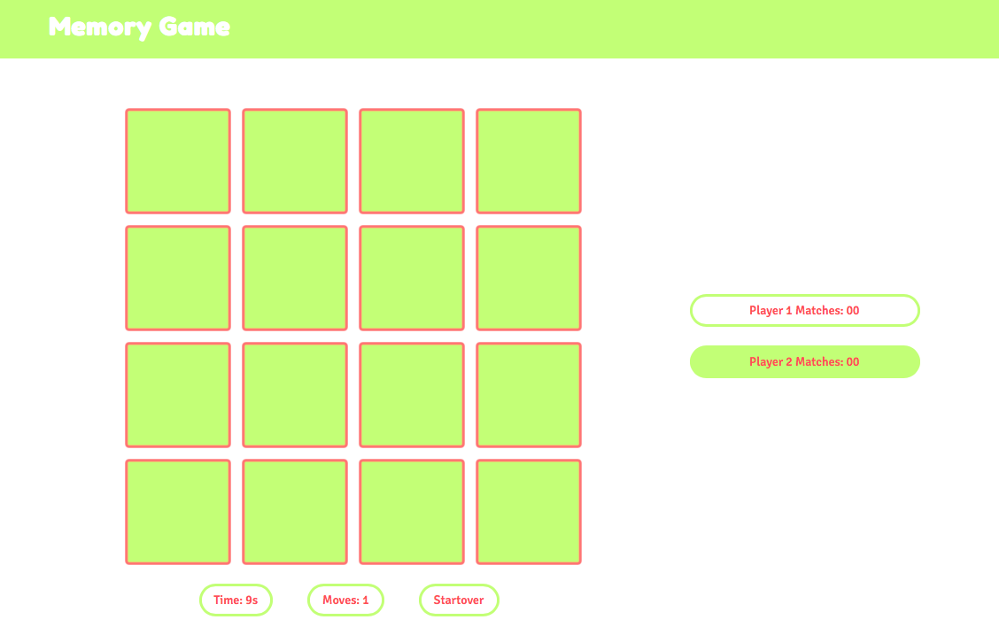
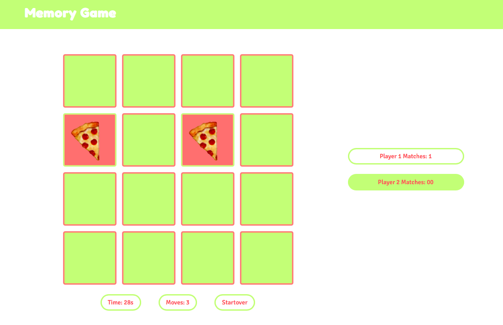
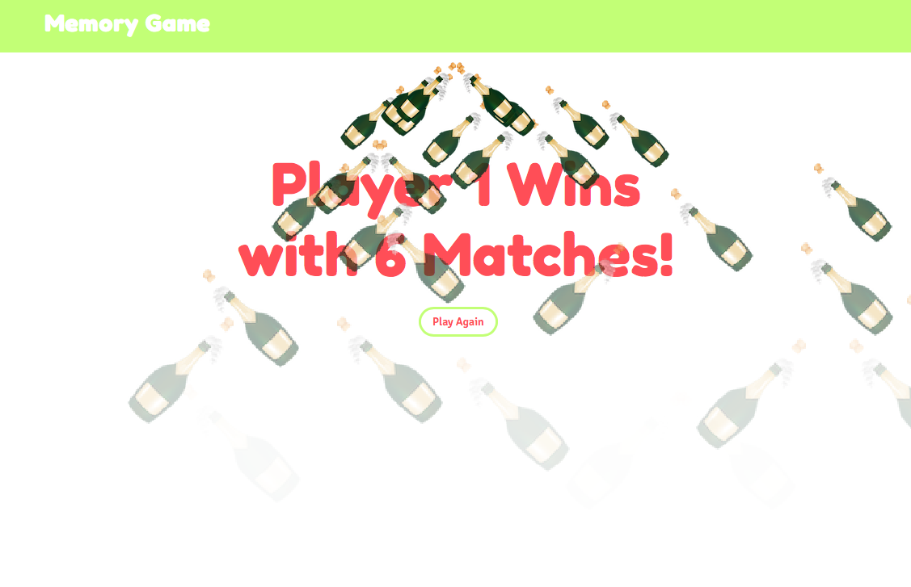

### PROJECT #1: Emoji Memory Game

This is a standard concentration memory game built with Javascript/jQuery ./project_folder/scripts.js.

I built a 4x4 grid of squares with 8 pairs of images with one player and two player modes
Players click on images...two for each turn to flip the squares and see the images.

**One Player Mode:**
Find all the pairs in as few moves as possible.

**Two Player Mode:**
Two players take turns.
Player who finds the most pairs wins the game.

In two player mode, the game keeps track of the score, and renders a message with who won and by how much when the match ends.
It also displays an animation where the champagne emojis 'rain' over the screen.

**Unsolved Problems**
Although the game works and is visible, and appropriately sized on mobile devices, I would like to improve on that so it adapts better to a vertical screen. 
